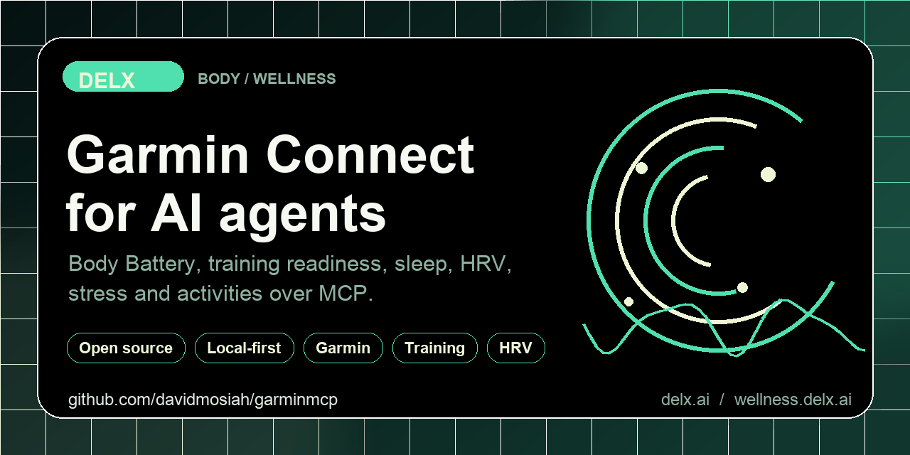

<!-- delx-wellness header v2 -->
<h1 align="center">Garmin MCP</h1>

<div align="center">
  
</div>

<h3 align="center">
  Give your AI agent your Garmin Body Battery, training readiness, sleep, HRV and activities.<br>
  Local-first MCP server &mdash; <strong>tokens never leave your machine</strong>.
</h3>

<p align="center">
  <a href="https://www.npmjs.com/package/garmin-mcp-unofficial"></a>
  <a href="https://www.npmjs.com/package/garmin-mcp-unofficial"></a>
  <a href="LICENSE"></a>
  <a href="https://wellness.delx.ai/connectors/garmin"></a>
</p>

<p align="center">
  <a href="https://github.com/davidmosiah/garminmcp/stargazers"></a>
  <a href="https://modelcontextprotocol.io"></a>
  <a href="https://github.com/davidmosiah/delx-wellness-hermes"></a>
  <a href="https://github.com/davidmosiah/delx-wellness"></a>
</p>

> ⚡ **One-command install** with [Delx Wellness for Hermes](https://github.com/davidmosiah/delx-wellness-hermes):
> `npx -y delx-wellness-hermes setup` &mdash; preconfigures this connector and the other 8 in a dedicated Hermes profile.
>
> Or wire it standalone into Claude Desktop / Cursor / ChatGPT Desktop &mdash; see the install section below.

---

<!-- /delx-wellness header v2 -->

**Local-first MCP server that connects AI agents to your Garmin sleep, HRV, Body Battery, stress, training readiness and activities.**

> **Unofficial project.** Not affiliated with, endorsed by or supported by Garmin. This is **not** official Garmin Health API partnership access — it uses the unofficial Garmin Connect personal-token mode.

Built by [David Mosiah](https://github.com/davidmosiah) for people who use Claude, Cursor, Hermes, OpenClaw or other MCP-compatible agents to think about training, sleep and recovery — without copy-pasting numbers from the Garmin Connect app.

Part of [Delx Wellness](https://github.com/davidmosiah/delx-wellness), a registry of local-first wellness MCP connectors.

> If this connector helps your agent workflow, please star the repo. Stars make the project easier for other AI builders to discover and help Delx keep shipping local-first wellness infrastructure.

## Why this exists

Garmin produces some of the best processed wellness signals — sleep stages, HRV status, Body Battery, stress, training readiness, training status, intensity minutes — but its official Garmin Health API is partner-licensed and not self-serve for individuals.

This package gives individual Garmin users a practical bridge: it logs into Garmin Connect with your own credentials locally (never sent to any agent), keeps tokens on your machine, and exposes Garmin signals through the Model Context Protocol. Your password never reaches the MCP — only short-lived Garmin Connect tokens are stored.

## Setup in 60 seconds

No Garmin developer app is required. `setup` only writes local MCP configuration; it does not ask for your Garmin password.

```bash
npx -y garmin-mcp-unofficial setup            # writes local config
npx -y garmin-mcp-unofficial auth --install-helper   # installs Garmin login helper, prompts for credentials locally
npx -y garmin-mcp-unofficial doctor           # verifies you're ready
```

Or one shot:

```bash
npx -y garmin-mcp-unofficial setup --auth
```

The auth helper prompts locally for Garmin email, password and MFA when needed. The MCP **does not store your Garmin password** — only Garmin Connect tokens, saved at `~/.garmin-mcp/garmin_tokens.json` with user-only permissions.

If macOS/Homebrew Python blocks helper installs, `--install-helper` falls back to an isolated virtualenv under `~/.garmin-mcp/venv` instead of asking you to debug Python packaging.

Then add this to your MCP client config:

```json
{
  "mcpServers": {
    "garmin": {
      "command": "npx",
      "args": ["-y", "garmin-mcp-unofficial"]
    }
  }
}
```

## Try it with your agent

Three things to ask first:

```text
Use garmin_connection_status to check setup, then run garmin_daily_summary.
Give me a 5-line operating brief for today.
```

```text
Call garmin_weekly_summary with response_format=json. Identify my biggest
recovery/sleep/stress bottleneck and give me a next-week plan.
```

```text
Use the garmin_intraday_investigation prompt for date=today, focus=stress.
Don't claim Garmin can prove anything it can't.
```

## Data availability

This package reads processed Garmin Connect data via the unofficial personal-token mode. When this README says `raw`, it means upstream Garmin Connect JSON — **not** raw accelerometer / gyroscope / continuous device telemetry.

| Data | Available | Notes |
|---|:---:|---|
| Sleep duration + stages + score | ✓ | When the device/account supports it |
| HRV status + overnight HRV | ✓ | When supported by device/account |
| Body Battery (daily + events) | ✓ | Charge/drain reports |
| Stress samples + daily summary | ✓ | Per-day stress context |
| Training readiness + training status | ✓ | When supported by device/account |
| Daily movement (steps, calories, distance, floors, intensity minutes) | ✓ | Standard wellness signals |
| Heart rate (resting + daily samples) | ✓ | Per-day samples and resting HR |
| Activities + details + splits + zones | ✓ | Recent activities and detail payloads |
| Body composition / weight + hydration | ✓ | When logged |
| Continuous device telemetry / accelerometer / gyroscope | — | Not exposed by Garmin Connect web endpoints |

> Garmin can change private auth or endpoints at any time. Failures should be treated as integration drift, not user error.

## Tools

**Start with these:**

- `garmin_connection_status` — verify local setup before calling Garmin Connect
- `garmin_data_inventory` — inventory supported data domains, scopes, privacy modes and recommended first calls without calling Garmin APIs.
- `garmin_daily_summary` — daily readiness, sleep, load, action candidates
- `garmin_weekly_summary` — scorecard, bottlenecks, next-week plan

**Auth & diagnostics**

- `garmin_capabilities`, `garmin_agent_manifest`, `garmin_auth_instructions`, `garmin_privacy_audit`

**Profile & devices**

- `garmin_get_profile`, `garmin_get_user_settings`
- `garmin_list_devices`, `garmin_get_primary_training_device`

**Daily wellness signals** (each takes a `date`)

- `garmin_get_daily_summary`, `garmin_get_steps_day`
- `garmin_get_sleep_day`, `garmin_get_heart_day`, `garmin_get_hrv_day`
- `garmin_get_stress_day`, `garmin_get_body_battery_day`, `garmin_get_body_battery_events`
- `garmin_get_training_readiness_day`, `garmin_get_training_status_day`
- `garmin_get_respiration_day`, `garmin_get_spo2_day`
- `garmin_get_intensity_minutes_day`, `garmin_get_hydration_day`

**Activities**

- `garmin_list_activities`, `garmin_get_activity_details`

**Body & weight**

- `garmin_get_weight_range`

## Prompts

- `garmin_daily_checkin` — practical daily health and training check-in
- `garmin_weekly_review` — review trends across activity, sleep, stress, Body Battery, heart
- `garmin_intraday_investigation` — investigate one day's signals (heart, stress, Body Battery, activity)

## Resources

- `garmin://capabilities`, `garmin://agent-manifest`
- `garmin://summary/daily`, `garmin://summary/weekly`

## Privacy & security

- Garmin Connect tokens are stored at `~/.garmin-mcp/garmin_tokens.json` with user-only permissions and are never returned by tools.
- **Your Garmin password is never stored** — only short-lived Garmin Connect tokens persist locally.
- `GARMIN_PRIVACY_MODE` defaults to `summary` (more conservative than other Delx Wellness connectors) because the auth model is unofficial.
- Local cache is opt-in via `GARMIN_CACHE=sqlite`.
- The MCP client never sees Garmin credentials or tokens.
- This is **not medical advice**. The server exposes user-authorized data for personal AI workflows, not diagnosis or treatment.

## Configuration

```bash
GARMIN_TOKEN_PATH=~/.garmin-mcp/garmin_tokens.json
GARMIN_PRIVACY_MODE=summary                  # summary | structured | raw
GARMIN_CACHE=sqlite                          # optional read-through cache
GARMIN_CACHE_PATH=~/.garmin-mcp/cache.sqlite
GARMIN_DOMAIN=garmin.com                     # or garmin.cn for China accounts
```

## Hermes / remote setup

```bash
npx -y garmin-mcp-unofficial setup --client hermes
npx -y garmin-mcp-unofficial auth --install-helper
npx -y garmin-mcp-unofficial doctor --client hermes
hermes mcp test garmin
```

After Hermes config changes, use `/reload-mcp` or `hermes mcp test garmin`. Don't restart the gateway for normal data access.

### Human-to-agent handoff

Paste this into your agent when you want it to install the bridge for you:

```text
Install the unofficial Garmin MCP server for me.
Repository: https://github.com/davidmosiah/garminmcp
Run setup, then auth --install-helper, then doctor.
If this is Hermes, use setup --client hermes and reload MCP with /reload-mcp or hermes mcp test garmin.
Never ask me to paste Garmin passwords, tokens or raw private payloads into chat.
Start with garmin_connection_status, then garmin_daily_summary.
This is not medical advice.
```

## Requirements

- Node.js 20+
- A Garmin Connect account with active devices
- Python 3 available locally (used by the auth helper; an isolated venv is created if needed)

## Development

```bash
git clone https://github.com/davidmosiah/garminmcp.git
cd garminmcp
npm install
npm test
npm run build
```

Test with MCP Inspector:

```bash
npx @modelcontextprotocol/inspector node dist/index.js
```

## Links

- npm: <https://www.npmjs.com/package/garmin-mcp-unofficial>
- Docs site: <https://wellness.delx.ai/connectors/garmin>
- Legacy docs: <https://garminconnectmcp.vercel.app/>
- GitHub: <https://github.com/davidmosiah/garminmcp>
- Delx Wellness registry: <https://github.com/davidmosiah/delx-wellness>
- Connector quality standard: <https://github.com/davidmosiah/delx-wellness/blob/main/docs/connector-quality-standard.md>
- Garmin Health API program (official, partner-licensed): <https://developer.garmin.com/gc-developer-program/health-api/>

<!-- delx-wellness see-also -->

## See also

The full [Delx Wellness](https://wellness.delx.ai) connector library:

| Provider | Package | Repo |
|---|---|---|
| WHOOP | [`whoop-mcp-unofficial`](https://www.npmjs.com/package/whoop-mcp-unofficial) | [whoop-mcp](https://github.com/davidmosiah/whoop-mcp) |
| Oura | [`oura-mcp-unofficial`](https://www.npmjs.com/package/oura-mcp-unofficial) | [ouramcp](https://github.com/davidmosiah/ouramcp) |
| Garmin | [`garmin-mcp-unofficial`](https://www.npmjs.com/package/garmin-mcp-unofficial) | [garminmcp](https://github.com/davidmosiah/garminmcp) |
| Strava | [`strava-mcp-unofficial`](https://www.npmjs.com/package/strava-mcp-unofficial) | [strava-mcp](https://github.com/davidmosiah/strava-mcp) |
| Fitbit | [`fitbit-mcp-unofficial`](https://www.npmjs.com/package/fitbit-mcp-unofficial) | [fitbitmcp](https://github.com/davidmosiah/fitbitmcp) |
| Withings | [`withings-mcp-unofficial`](https://www.npmjs.com/package/withings-mcp-unofficial) | [withingsmcp](https://github.com/davidmosiah/withingsmcp) |
| Apple Health | [`apple-health-mcp-unofficial`](https://www.npmjs.com/package/apple-health-mcp-unofficial) | [apple-health-mcp](https://github.com/davidmosiah/apple-health-mcp) |
| Polar | [`polar-mcp-unofficial`](https://www.npmjs.com/package/polar-mcp-unofficial) | [polarmcp](https://github.com/davidmosiah/polarmcp) |
| Nourish (nutrition) | [`wellness-nourish`](https://www.npmjs.com/package/wellness-nourish) | [wellness-nourish](https://github.com/davidmosiah/wellness-nourish) |

**One-command setup for Hermes** — preconfigures every connector above plus wellness skills + onboarding: [`delx-wellness-hermes`](https://github.com/davidmosiah/delx-wellness-hermes).

<!-- /delx-wellness see-also -->

## License

MIT — see [LICENSE](LICENSE).

## Disclaimer

This software is provided as-is. It is not a medical device, does not provide medical advice, and should not be used for diagnosis or treatment. The unofficial Garmin Connect mode can break if Garmin changes private auth or endpoints. Always consult qualified professionals for medical concerns.
